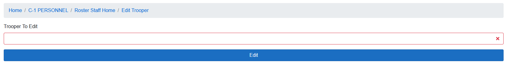
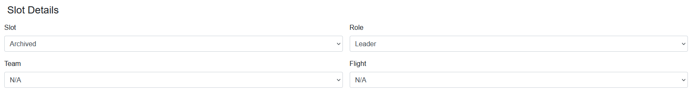
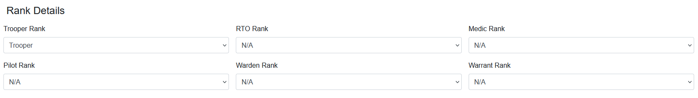
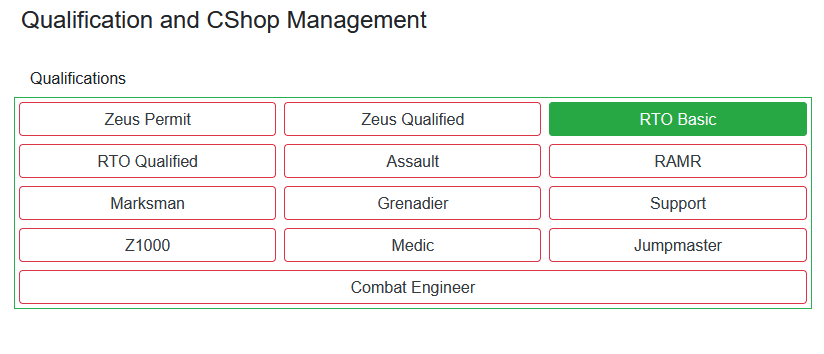
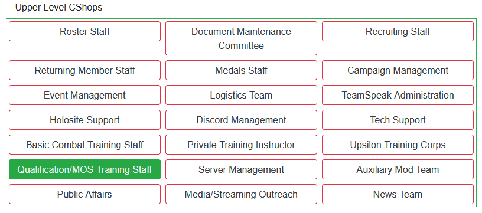
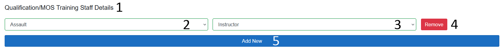
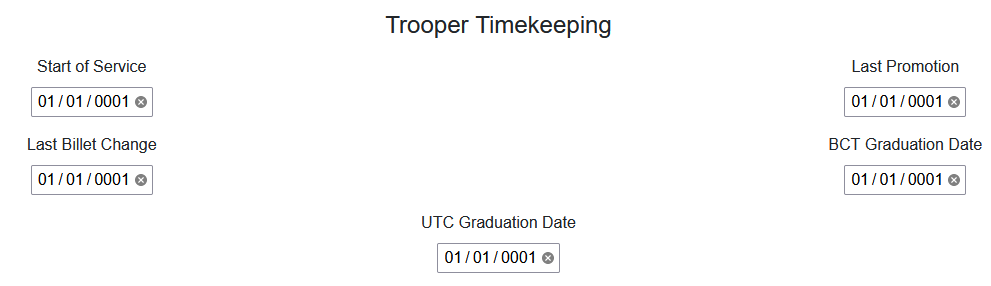
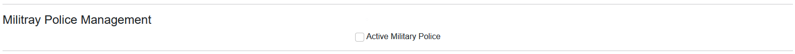
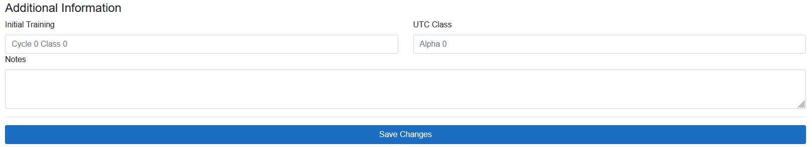

<!-- docs/c1/editing-troopers.md -->
# Editing Troopers
The edit trooper page can be found from the Roster Clerk and Returning Member home pages in C-1, or with [this link](https://s4.501stlegion-a3.com/c1/roster/edit).

## Before The Edit

The blank box under Trooper To Edit will autofill with trooper names and birth numbers. It takes both a Nickname and Birth Number as input, and will light up green when a trooper has been selected. Press Edit to start editing the selected trooper.

## Editing Slots

!> Roster Edits from this form **do not** automatically update trooper times. If a billet change occurs, the date must be updated manually in the [timekeeping](#editing-trooper-times) section.

- Slot
    - Changes the slot of the trooper, such as from Avalanche 3-3 to Avalanche 3-2.
- Role
    - Changes the role of the trooper in their slot. An RTO in Avalanche 3-3 will be treated differently than an RTO in Avalanche 3 (the platoon command).
- Team
    - Changes what team a trooper is on in their slot. A Leader with no team is assumed to be a squad leader, while giving them alpha or bravo team will make then a team leader.
- Flight
    - Changes what flight a pilot is apart of.

## Editing Ranks

- Trooper Rank
    - Changes the troopers base rank.
- RTO Rank
    - Changes the RTO rank of a trooper.
- Medic Rank
    - Changes the Medic rank of a trooper.
- Pilot Rank
    - Changes the pilot rank of a trooper.
- Warden Rank
    - Changes the warden rank of a trooper.
- Warrant Rank
    - Changes the Chief Warrant Officer rank of a trooper.

## Editing Qualifications

Clicking any of the qualification buttons will change their state. A red outline means the trooper does not have that qualification, while a green box means the trooper does have the qualification.

## Editing C-Shops

Clicking any of the C-Shop buttons will change their state. A red outline means the trooper is not a part of that C-Shop, while a green box means the trooper is a part of that C-Shop.

If there is at least one (1) green box for C-Shops, additional settings will appear.

1. The name of the Upper Level C-Shop you are modifying. There will be one of these for each C-Shop button that is currently selected (green).
2. The position in the C-Shop this trooper has a role for. In the case of Qualification/MOS Training Staff, there is a selection for each Qualification and MOS that has training staff.
3. The rank/role of the trooper withing their position. For an Assault instructor (or any other instructor), you can select Cadre, Instructor, or Lead. These options change depending on different positions in different C-Shops.
4. This buttons removes a position and rank pair from the trooper. Use this to remove just a single part of the Troopers C-Shops. If they have left the C-Shop in its entirety, deselect the option from the upper level buttons list.
5. This allows you to add a new position and rank pair if the trooper needs it. For example, a trooper that is an instructor for two Qualifications would need two entries.

## Editing Trooper Times

- Start of Service
    - Change this troopers start of service date.
- Last Promotion
    - Change this troopers last promotion date.
- Last Billet Change
    - Change this troopers last billet change.
- BCT Graduation Date
    - Change the date this trooper graduated from BCT.
- UTC Graduation Date
    - Change the date this trooper graduated from UTC.

## Military Police Information

- Military Police Field
    - Check this box if the person you are editing is an active member of the Military Police.

## Final Edits

- Initial Training
    - A text box for a troopers initial training information.
- UTC Class
    - A text box for a troopers UTC class information.
- Notes
    - A text filed for any additional notes for this trooper, such as noting a returning member and who they were approved by.

## Saving Changes

The save changes button at the very bottom of the page will save any updates you have made to this trooper. Updates are logged so they can be reverted if absolutely needed. Any changes go into effect immediately, and adding people to C-Shops will grant them access to C-Shop specific pages and resources.