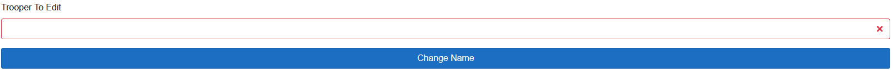
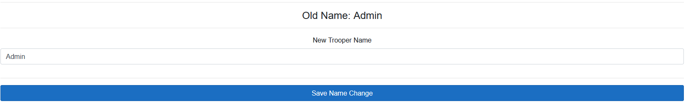

<!-- docs/c1/name-changes.md -->
# Name Changes

!> Name changes are limited to website managers and the C-1 Department Lead by default. Website managers are authorized to add new people to the list of troopers who can change names.

## Name Change Home

*A website manager has access to the name change edit button. It will not be displayed for any others.*

This image shows the homepage for name changes. Future plans will have it include pending name change requests along with other features.

To change a name, click the Name Change Form button and see the [Name Change Form](#name-change-form) section.

For information on how a manager can add troopers to the list of authorized name changers, click the edit button and see the [next section](#adding-authorized-name-changers). If you do not see the edit button, contact a website manager for access.

## Adding Authorized Name Changers

1. The Save button is used to save any changes. This will also close the edit form.
2. The text box here is used to enter new troopers to give them access. There is an autofill option and it does accept Nicknames as well as Birth Numbers.
3. This is a valid trooper that has been given access. It has green text and a green outline. To revoke their access, press the black `x` to the right of their name.
4. This is an invalid trooper. It means the username/birth number entered could not be found. Press the black `x` to the right of the invalid name/birth number to remove this item from the list.

## Name Change Form

The first step is to select the trooper to change a name from. Enter their Birth Number or Nickname into the text box. There is an autofill. Once a valid trooper has been selected, the box will be outlined in green. Press the Change Name button to continue.

!> Unlike the recruitment page, there is no check to ensure a name is changed to an already in use name.

- Old Name
    - This piece of text shows the current name of the trooper, before any edits have been made.
- New Trooper Name
    - This textbox is where you change the name to the new trooper name.
- Save Name Change
    - This button saves the name change. It will also close the editor.