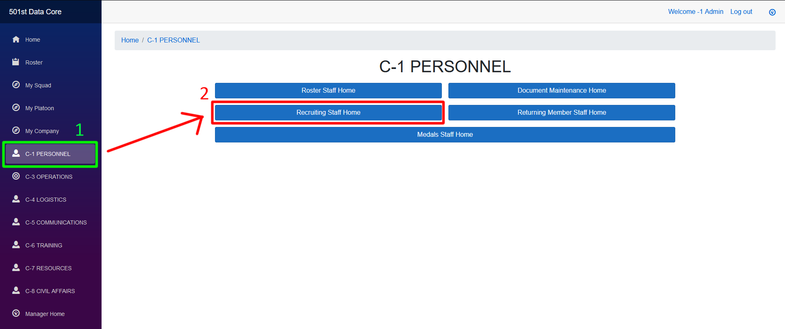
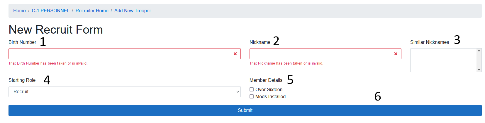
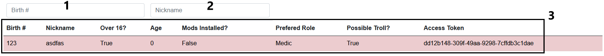

<!-- docs/c1/recruiting.md -->
# Recruiting Home
Recruiters have access to the C-1 PERSONNEL homepage. From that page, select the Recruiting Staff Home button to navigate to the Recruiting Staff area.

Once in the recruiting home page, there are two pages of importance. The New Recruit Form is where a recruiter creates an account for a new recruit and registers them with the Data Core. The Unregistered Troopers page contains access codes for all non-registered accounts.

## New Recruit Form

1. The birth number field is where the new recruit's birth number will be entered. It does not allow repeated birth numbers.
2. The Nickname filed is where the trooper nickname will go. It does not allow repeated nicknames for active troopers, and shows similar nicknames (3) to the one entered.
3. Shows similar nicknames to the value entered in the Nickname box (2)
4. The starting rank of this recruit. Mainly to be used by returning member staff in the event a new account is needed for some reason.
5. Additional member details for use in later systems.
6. The preferred role of this recruit. 
7. Possible Troll Button. This button is to be used in the event that you believe this recruit is a troll, but do not have sufficient evidence. To use, click the white check box to the left, and hit the Possible Troll button to confirm the selection.
8. Submit button. If a new account has been created, a popup will show with the new access code for the account you just created.

## Unregistered Troopers

1. Filter the display (3) by Birth Number
2. Filter the display (3) by Nickname
3. The display portion shows a single row per trooper who has not registered their account. The first seven columns show details about the trooper, while the eigth column holds the troopers access code. This should be given to the trooper so they can register their account.