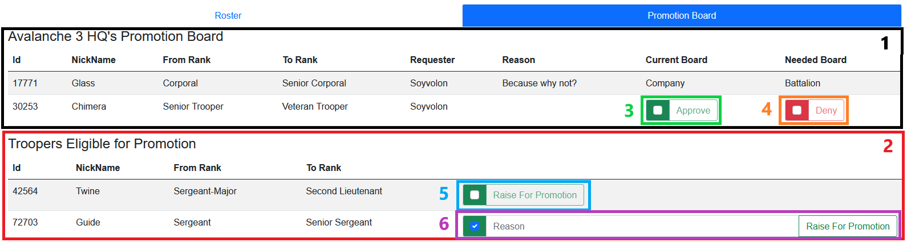

<!-- docs/leadership/promotions.md -->
# Promotions

## Overview

1. Displays the Current Units Active Promotion Request
2. Displays current Troopers that meet requirements for promotion.
3. The `Approve` Button will Approve the Troopers Promotion and do one of two things.
    - If the promotion requires approval from a higher command, then the promotion will move to the next promotion board.
    - If the promotion is already at the highest command needed, then the promotion will already be approved, and the promotion will auto populate.
4. The `Deny` Button will Deny the Troopers Promotion. This will cancel the promotion request and no changes will be made.
5. The `Raise for Promotion` Button will Raise this Trooper for Promotion. Clicking the Check Box will expand the Button to provide a reason for promotion.
6. The expanded `Raise for Promotion` Button includes a text field to include a reason for promotion.
 
## Standard Promotion Requests

Standard Promotion Requests are Promotions that are submitted from the Troopers already displayed on the `Troopers Eligible for Promotion` Section. These Troopers meet the requirements for promotion in the Data Core already. 

> All members of Leadership should submit promotions through the `Troopers Eligible for Promotion` Section. The `Start Promotions Process` Button should only be used if you are certain the Trooper you are trying to promote does not appear, but you know they meet the requirements for promotion.

## Forced Promotion Requests

Forced Promotion Requests are Promotions that are submitted manually via the `Start Promotions Process` Button. This is a way for leadership to submit promotion requests for people that do not meet the requirements on the Data Core. If the Trooper with the active Promotion meets the requirements, the promotion request will revert to a standard promotion request.

All Forced Promotion Requests are highlighted in red on their respective promotion boards. This is displayed in the image below.

!> Forced Promotion Requests should be treated as a last resort method of putting a Trooper up for promotion. If it is possible, submit a Standard Promotion Request before a Forced Promotion Request.

## Approving/Denying Promotions

If you are an approving party, you can approve or deny promotion from your unit's promotion boards.

To Approve or Deny, click the check box to the left of the respective button, and then press the button.