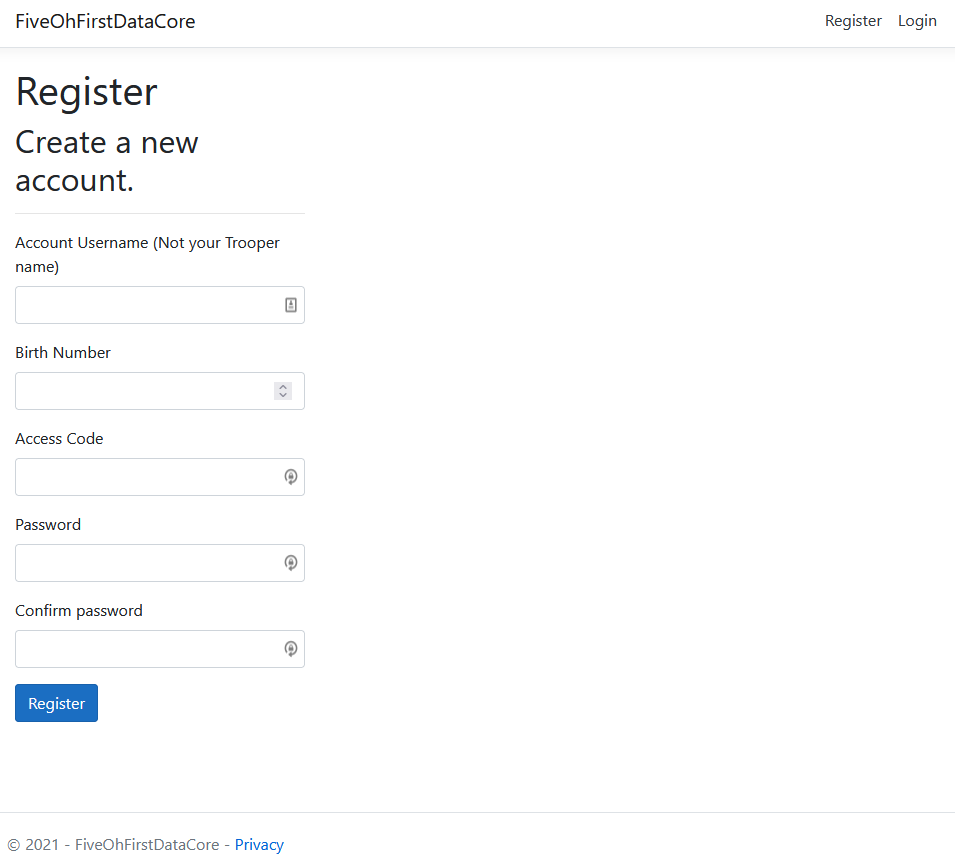
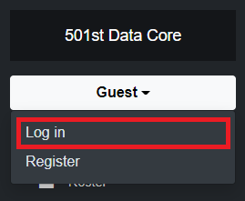
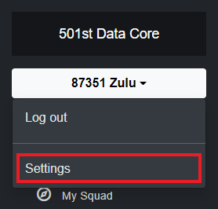

# Register Your Account
!> You need an access code to register an account! New members and returning members need to talk to a [recruiter](get-recruited)/returning member staff. Current members should talk to their CoC for their access code.

## Account Registration Page
On the Data Core website, select `Register` in the top right corner, or use [this link](https://dc.501stlegion-a3.com/Identity/Account/Register) to get to the registration page.

A registration page like the following will be displayed.

## Registration Fields
### Account Username
This filed is your account username. It does not have to be the same as your Trooper Name, and in some cases you won't be able to have it the same. It is only used for logging into the website, and is not publicly displayed anywhere (still keep it SFW).

### Birth Number
This is your trooper birth number. It is used to identify your account, and must match the birth number you pick when getting recruited. Accounts are not deleted, so returning members will have the same birth number and do not need to register a new account if they have already registered.

### Access Code
This will be the code that is give to you by your recruiter and/or returning member staff. This is a private, one time use, code so do not share it with others.

### Password and Confirm Password
These fields are for setting your account password. They must match and will be the password you use to login to your account.

## After Hitting Register
### Account Links
Once you hit the register button, you will be redirected to a Discord and then a steam login. This links your 501st Data Core account with Discord and steam so our automated systems will work properly with your account.

You will not be able to sign in until you complete this process.

### Logging In and Out
To log in and out, go to the sidebar on the left side of your display, and click the drop down menu. If you are logging in, the dropdown will contain the word "Guest". If you are logging out, the drop down will contain both you birth number and name. The option to both log in and log out will be found at the top of the drop down menu.

### User Information
501st Data Core will save your email from Discord to use in the event you need to reset your password. If you need this changed, you can go the manage account page. To go to the manage account page, click the dropdown icon on the left side of your screen with your name, and click "settings".

Once on this page, you can change your email address and password from the options on the left side of the screen.