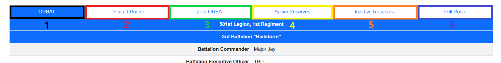
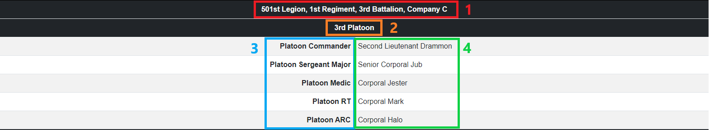
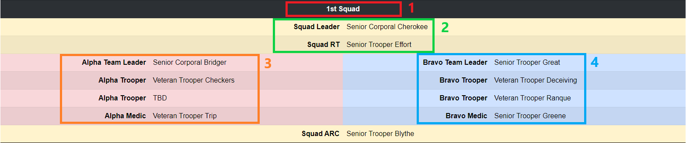
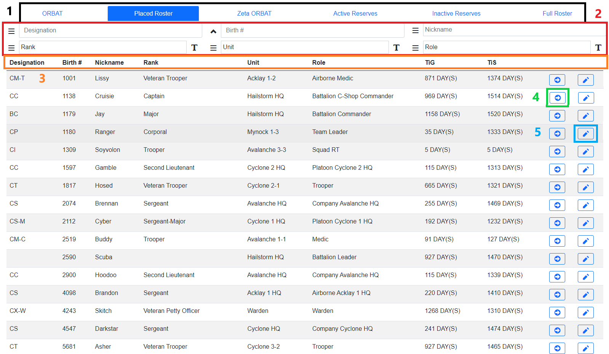
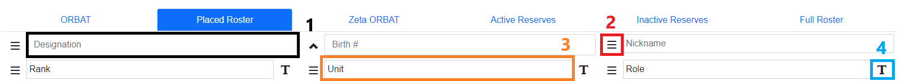

<!-- docs/roster.md -->
# Roster System

## Overview
The roster page can be found from the Roster Page on the Home Screen, or with [this link](https://dc.501stlegion-a3.com/roster).

The roster pages contains 6 tabs.

1. The ORBAT Tab displays the overall organization of the 501st Legion. All active duty units and subunits are displayed.
2. The Placed Roster Tab contains information on every trooper within the 501st organization, with the exception of Zeta Company.
3. The Zeta ORBAT displays the overall organization of the Zeta Reservist Company within the 501st Legion. Zeta is displayed here and not in the Main ORBAT tab as it is a Reserve Unit.
4. The Active Reserves Roster contains information on every trooper within the Zeta Reservist Company.
5. The Inactive Reserves Roster contains information on every trooper within the 501st that is not actively assigned to a Unit. These individuals, for all intents and purposes are considered inactive, with some exceptions.
6. The Full Roster contains information on every trooper within the 501st. Period.

## ORBAT Sheets
The ORBAT Sheets display the following units (including sub-units). 

- ORBAT
    - Hailstorm Battalion Command
    - Avalanche Company
    - Cyclone Company
    - Acklay Detachment
    - Mynock Detachment
    - Razor Squadron
- Zeta ORBAT
    - Hailstorm Battalion Command
    - Zeta Reservist Company

### Headquarters Unit Displays
Headquarters Units (Being Platoon, Company, and Battalion HQs) are displayed as follows.

1. The **Parent Unit** of the Currently displayed unit.
2. The **Currently Displayed Unit**
3. **Billets(Positions)** within the currently displayed unit.
4. **Personnel** currently holding a position within the displayed unit.

### Squad Unit Displays
Squad Units (Infantry Squad, Mynock Section, Razor Flight) are displayed as follows.

1. The **Currently Displayed Squad**
2. The **Command Team** is highlighted in yellow.
3. The **Alpha FireTeam** is highlighted in red.
4. The **Bravo FireTeam** is highlighted in blue.

## Roster Sheets
While the ORBAT Sheets are good for looking at a glance. The Roster Sheets show comprehensive information about every trooper within the 501st Legion.

### Information
When you select a roster page, it will display as follows. The sheet will display everyone related to that specific roster page, and will default to sorting by birth number from lowest to highest.

1. At the top of the sheet are the tabs to switch between different rosters.
2. Below that are all the search options to search for specific troopers within that roster page.
3. The first row of the data are the headers, which display what data is being shown.
4. The `Trooper Details` Button will open a new page containing details of that specific trooper.
5. The `Roster Edit` Button will open the troopers information on the roster edit form. This button will only be displayed if you have the required access.

### Searching the Roster

Each roster page contains a comprehensive search function within them.

#### Overview

1. The top 3 search bars are for Designation, Birth Number, and Nickname specifically. When something is typed in, the roster will display all troopers found that match that specific field. The data displayed can also be sorted by the `Sort Button` to the left of every search box.
2. The `Sort Button` has 3 modes.
    - The default 3 line hamburger icon shows that the roster is not currently being sorted by that field.
    - Clicking the icon once will change it to an arrow pointing up, this sorts the data going from A to Z, or lowest to highest, for that specific field.
    - Clicking the icon again will change it to an arrow pointing down, this sorts the data going from Z to A, or highest to lowest, for that specific field.
    - Clicking the icon a third time will revert it back to the default 3 line hamburger icon.
3. The bottom 3 search bars are for Rank, Unit, and Role specifically. These search bars default to a dropdown menu, however, clicking the `Drop Down Toggle Button` to the right of every search box will change the dropdown to a text box to search manually. The data displayed can also be sorted by the `Sort Button` to the left of every search box.
4. The `Drop Down Toggle Button` has 2 modes.
    - The default icon displaying the letter 'T' shows that the search box is currently in dropdown mode.
    - Clicking the icon once will change it to an icon with two price tags, this changes the dropdown box to manual search mode.